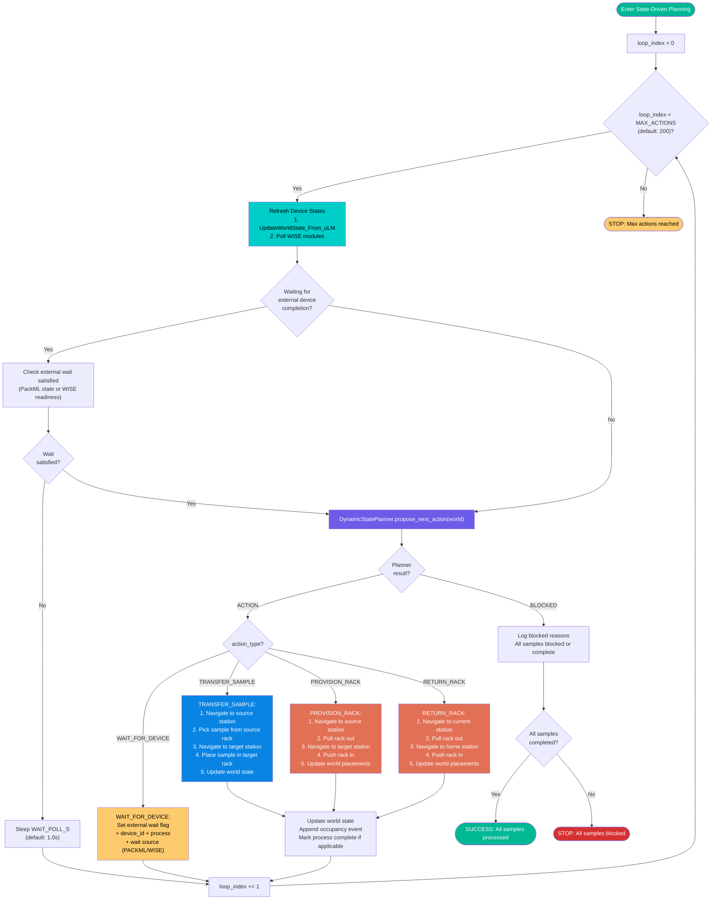
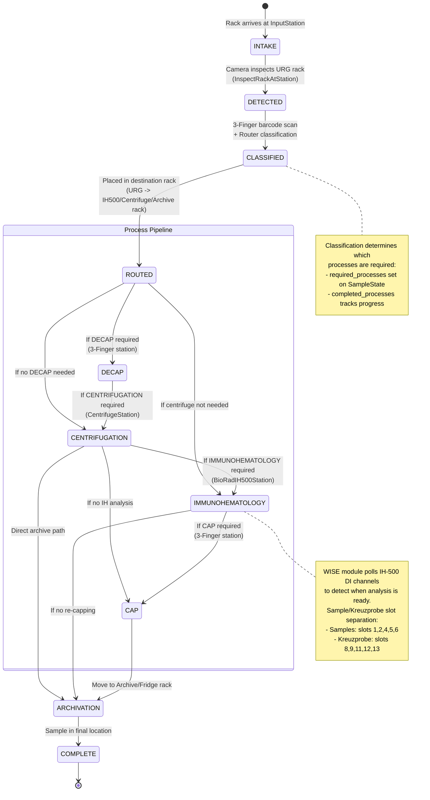
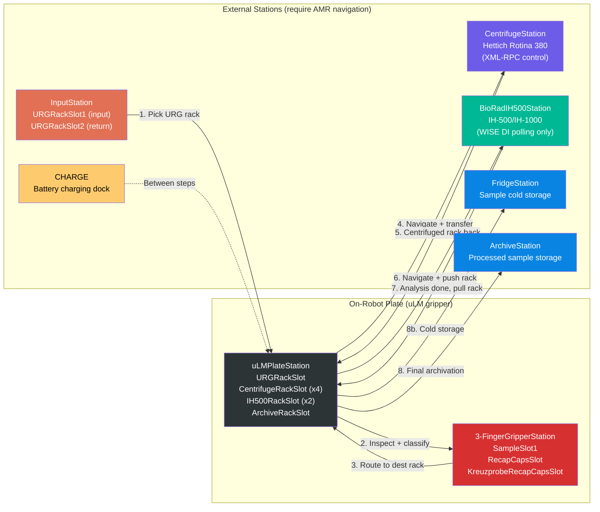
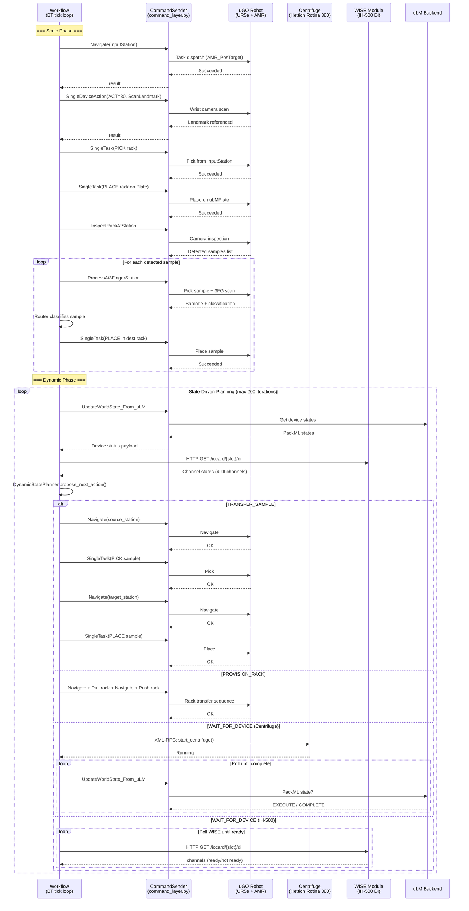
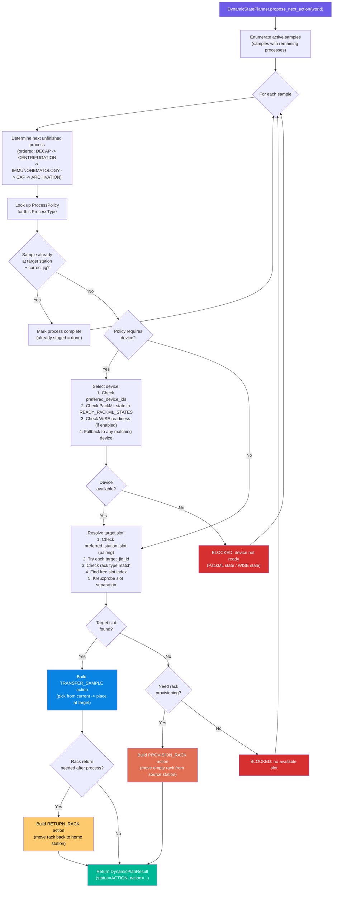
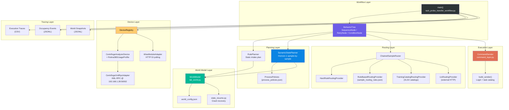

# uGO-Brain System Behavior Diagrams

## 1. Main Workflow Behavior Tree (GETTING_NEW_SAMPLES mode)

```mermaid
graph TD
    ROOT["SequenceNode: RackAndProbeTransferFlow"]

    ROOT --> V["RetryNode: ValidateScaffoldPrerequisites"]
    V --> VC["ConditionNode: check stations, tasks,<br/>planner, policies exist"]

    ROOT --> P1["RetryNode: await_input_rack_present"]
    P1 --> P1C["PHASE: Wait for URG rack<br/>at InputStation.URGRackSlot1"]

    ROOT --> P2["RetryNode: nav_input"]
    P2 --> P2C["TASK: Navigate<br/>AMR drives to InputStation"]

    ROOT --> P3["RetryNode: scan_input_landmark"]
    P3 --> P3C["TASK: SingleDeviceAction<br/>ACT=30 Scan Landmark"]

    ROOT --> P4["RetryNode: transfer_input_rack"]
    P4 --> P4C["PHASE: Pick rack from InputStation<br/>Place rack on uLMPlate"]

    ROOT --> P5["RetryNode: charge"]
    P5 --> P5C["TASK: Charge<br/>at CHARGE station"]

    ROOT --> P6["RetryNode: camera_inspect_urg_for_new_samples"]
    P6 --> P6C["PHASE: InspectRackAtStation<br/>Camera detect samples, register in world"]

    ROOT --> P7["RetryNode: urg_sort_via_3fg_router"]
    P7 --> P7C["PHASE: RouteUrgVia3Finger<br/>Pick each sample -> scan barcode at 3FG<br/>-> classify -> place in destination rack"]

    ROOT --> P8["RetryNode: handoff_to_state_driven_planning"]
    P8 --> P8C["PHASE: DynamicStatePlanner loop<br/>(see Diagram 2)"]

    style ROOT fill:#2d3436,color:#fff,stroke:#636e72
    style V fill:#6c5ce7,color:#fff
    style P1 fill:#0984e3,color:#fff
    style P2 fill:#0984e3,color:#fff
    style P3 fill:#0984e3,color:#fff
    style P4 fill:#00b894,color:#fff
    style P5 fill:#0984e3,color:#fff
    style P6 fill:#00b894,color:#fff
    style P7 fill:#00b894,color:#fff
    style P8 fill:#d63031,color:#fff
    style VC fill:#a29bfe,color:#000
    style P1C fill:#74b9ff,color:#000
    style P2C fill:#74b9ff,color:#000
    style P3C fill:#74b9ff,color:#000
    style P4C fill:#55efc4,color:#000
    style P5C fill:#74b9ff,color:#000
    style P6C fill:#55efc4,color:#000
    style P7C fill:#55efc4,color:#000
    style P8C fill:#ff7675,color:#000
```

## 2. Dynamic State-Driven Planning Loop

## 3. Sample Lifecycle State Machine

## 4. Lab Topology & Physical Flow

## 5. Device Communication Architecture

## 6. Planner Decision Logic

## 7. Component Architecture Overview

---

## How to View These Diagrams

1. **VS Code**: Install the "Markdown Preview Mermaid Support" extension, then open this file and press `Ctrl+Shift+V`
2. **GitHub**: Push this file -- GitHub renders Mermaid natively in markdown
3. **Mermaid Live Editor**: Copy any code block to [mermaid.live](https://mermaid.live)
